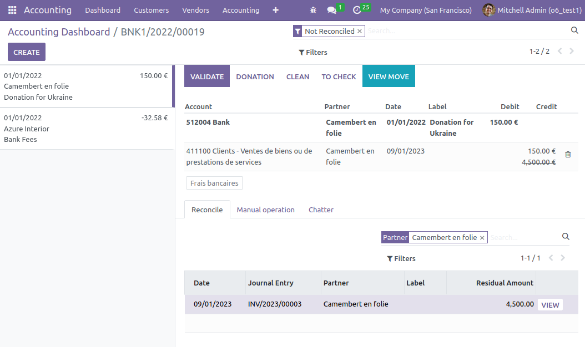
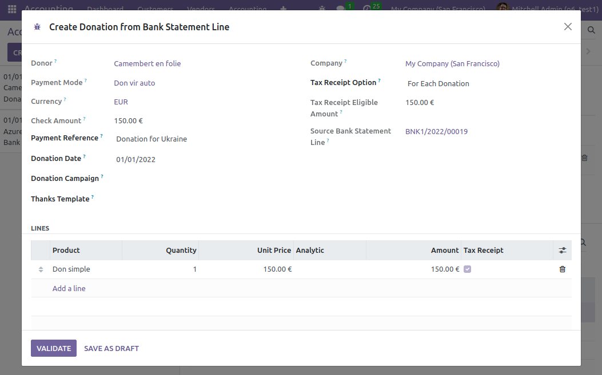

In the OCA bank statement reconcile interface, you have a new button
**Donation**.

When you click on that **Donation** button, Odoo opens a pop-up with a
simplified pre-filled donation form view.

On this donation form view, you can modify the donation and then:

- validate-it
- or save it as draft
